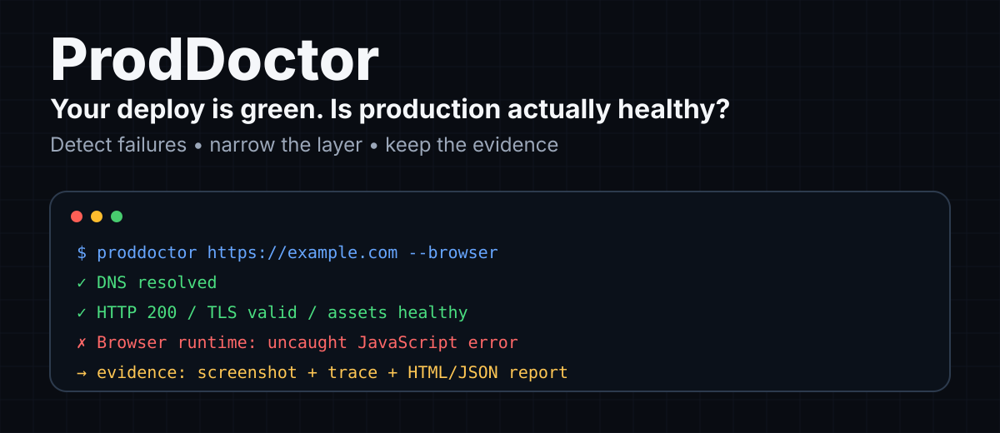
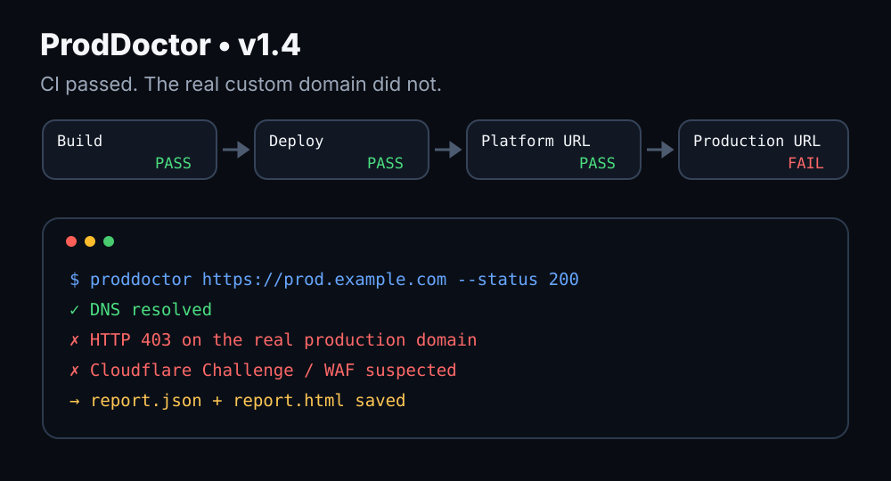

# ProdDoctor

<p align="center">
  <a href="./README.md">English</a> · <strong>简体中文</strong>
</p>

[](https://github.com/lucaswenbo/ProdDoctor/actions/workflows/test.yml)
[](https://github.com/lucaswenbo/ProdDoctor/actions/workflows/action-smoke.yml)
[](https://github.com/lucaswenbo/ProdDoctor/actions/workflows/browser-smoke.yml)


<p align="center">
  
</p>

**部署成功，不等于用户真的能正常打开生产环境。**

```text
CI / Build          ✅
Deploy              ✅
平台地址             ✅
真实生产域名          ❌
```

ProdDoctor 会在部署之后继续检查**用户真正访问到的那条生产链路**，并帮你把问题缩小到更可能出错的层。

它会检查 DNS、HTTP、TLS、页面内容、同源资源、Cloudflare/WAF，以及可选的真实 Chromium 运行时；失败时还能保留请求信息、截图、Playwright Trace 和 HTML/JSON 报告。

> **CI 绿了，只能说明流水线跑完了。ProdDoctor 检查的是生产环境到底能不能真的用。**

## 30 秒接入

下面这段是 **GitHub Actions 的一个 step**，不是终端命令。把它放到你要检查的网站仓库中，例如 `.github/workflows/production-check.yml`，并放在某个 job 的 `steps:` 下面。

```yaml
- uses: lucaswenbo/ProdDoctor@v1.5.0
  with:
    url: https://example.com
    expect: My Website
    language: zh-CN
```

人类可读输出默认使用英文；需要中文时设置 `language: zh-CN`。

不需要 Cloudflare API Token，也不需要修改你的部署平台配置。

### 一个典型故障

<p align="center">
  
</p>

上面的场景里，构建、部署和平台地址都正常，但真实生产域名返回 Cloudflare 403。ProdDoctor 不会只给出一个笼统的失败：它会显示 DNS 正常、HTTP 403，并把 Cloudflare Challenge / WAF 标为更可能的故障层，从而把排查范围缩小到边缘 / 安全层，同时保留报告证据供后续调试。

## 它和普通“探活”有什么区别？

普通健康检查往往只能告诉你“这个 URL 返回了 `200`”。ProdDoctor 更针对那些**部署看起来成功，但真实生产环境仍然坏了**的情况：

- 自定义域名命中了错误的 Route / Worker
- Cloudflare/WAF 在真实生产路径上把请求拦了
- HTML 是 `200`，但 JS/CSS 资源已经坏掉
- 服务端响应正常，但 Chromium 执行后白屏或抛运行时错误
- 状态码成功，但用户拿到的是错误版本页面

它的目标不只是给你一个红灯，而是尽量留下足够证据，让下一步该查哪里更清楚。

## 它会检查什么

- DNS 是否能够解析
- 真实生产 URL 与最终 HTTP 状态
- 页面是否包含指定关键文本，避免“200 但页面错了”
- 重定向后的最终 URL
- Cloudflare Challenge / WAF 常见阻断特征
- TLS 证书链与剩余有效期
- 同源 JS / CSS 是否 404、5xx 或错误返回 HTML
- 可选 Playwright + Chromium 真浏览器渲染检查
- 未捕获 JavaScript 异常、关键同源请求失败和渲染后文本校验
- 浏览器整页截图、Playwright Trace 和统一 Evidence Artifact
- 独立 HTML / JSON Production Report
- desktop / mobile 两种浏览器视口预设
- `CF-Ray`、`CF-Cache-Status` 和 Server 响应信息
- `robots.txt` 与 `sitemap.xml`
- 常见安全响应头
- 请求耗时、失败重试、JSON 输出
- GitHub Actions Job Summary

> v1.5.0 默认仍保持轻量 HTTP 检查；需要时可以启用 Playwright + Chromium 浏览器模式。浏览器模式现在还可以生成移动端证据、失败 Trace、整页截图，以及独立的 HTML / JSON Production Report。

---

# 方法一：在 GitHub Actions 中使用

这是最推荐的使用方式。部署完成后让 ProdDoctor 自动检查真正的生产域名。

## 第 1 步：打开你的项目仓库

进入你需要检查的网站对应的 GitHub 仓库。

例如：

```text
your-name/your-website
```

## 第 2 步：创建 Workflow 文件

在仓库中新建：

```text
.github/workflows/production-check.yml
```

如果 `.github/workflows` 目录不存在，可以直接创建。

## 第 3 步：复制下面的内容

```yaml
name: Check production website

on:
  workflow_dispatch:

jobs:
  check:
    runs-on: ubuntu-latest

    steps:
      - uses: lucaswenbo/ProdDoctor@v1.5.0
        with:
          url: https://example.com
          language: zh-CN
```

把：

```text
https://example.com
```

替换成你自己的网站正式地址。

例如：

```yaml
url: https://www.example.com
```

## 第 4 步：提交文件

提交 `production-check.yml` 后，打开仓库顶部的：

```text
Actions
```

找到：

```text
Check production website
```

点击：

```text
Run workflow
```

ProdDoctor 就会从 GitHub Runner 直接访问你的生产网站。

## 第 5 步：查看结果

运行成功时，Workflow 会显示绿色状态。

在运行详情页面中还可以看到类似：

```text
🩺 ProdDoctor 生产环境体检
目标：https://example.com/
结果：✅ 通过

✅ DNS：93.184.216.34
✅ 页面：200，143ms，尝试 1 次
⚠️ robots.txt：HTTP 404
✅ sitemap.xml：HTTP 200
🛡️ 安全响应头：60/100

检查完成：生产页面通过主要可用性检查。
```

ProdDoctor 同时会把结果写入 GitHub Actions 的 Job Summary。

---

# 推荐配置：检查页面是否真的是正确版本

只检查 HTTP 200 还不够。

例如错误的 Worker、旧缓存页面或错误路由也可能返回 HTTP 200。

因此建议使用 `expect`，要求页面必须包含一个确定存在的文本。

例如你的网站首页一定有：

```text
My Website
```

可以写：

```yaml
name: Check production website

on:
  workflow_dispatch:

jobs:
  check:
    runs-on: ubuntu-latest

    steps:
      - uses: lucaswenbo/ProdDoctor@v1.5.0
        with:
          url: https://example.com
          expect: My Website
```

如果网站返回 HTTP 200，但页面中没有 `My Website`，检查仍然会失败。

### 注意

`expect` 当前使用精确字符串包含判断：

- 区分大小写
- 不支持正则表达式
- 检查的是服务器返回的原始 HTML
- JavaScript 后续动态生成的文字目前无法检测

如果你的页面内容完全依靠 React/Vue 等前端 JavaScript 渲染，不建议用动态文字作为 `expect`。

可以选择 HTML 中稳定存在的标题、meta 内容、版本号或静态标记。

---

# 推荐配置：部署成功后自动检查

ProdDoctor 最适合放在真正的部署步骤之后。

示例：

```yaml
name: Deploy and verify

on:
  push:
    branches:
      - main

jobs:
  deploy:
    runs-on: ubuntu-latest

    steps:
      - uses: actions/checkout@11d5960a326750d5838078e36cf38b85af677262

      # 在这里放你原本的构建和部署步骤
      # - run: npm ci
      # - run: npm run build
      # - run: your-deploy-command

      - name: Verify real production domain
        uses: lucaswenbo/ProdDoctor@v1.5.0
        with:
          url: https://example.com
          expect: My Website
          retries: 2
          timeout: 15000
```

这样只有在真实生产地址通过检查后，整个 Workflow 才会保持成功状态。

---

# 浏览器模式：检查“HTTP 正常，但页面实际坏了”

HTTP 检查可以确认服务器响应、TLS 和静态资源，但有些问题只有真正执行 JavaScript 后才会出现，例如：

```text
HTML              ✅ 200
app.js            ✅ 200
TLS               ✅
Browser render    ❌ white screen
pageerror         ❌ Cannot read properties of undefined
```

启用浏览器模式：

```yaml
- uses: lucaswenbo/ProdDoctor@v1.5.0
  with:
    url: https://example.com
    browser: true
```

启用后，GitHub Action 会在临时目录安装 Playwright 和 Chromium，不会修改你的项目依赖。

浏览器模式当前会检查：

- 主文档能否在 Chromium 中打开
- 未捕获的 JavaScript `pageerror`
- 同源 document / script / stylesheet 请求失败
- 同源关键资源返回 4xx / 5xx
- 页面标题
- 渲染后可见文本长度
- 可选的渲染后文本 `browser_expect`
- Console error
- 整页截图

### 检查渲染后的文字

如果某个文字只有 JavaScript 执行后才会出现，可以使用：

```yaml
with:
  url: https://example.com
  browser: true
  browser_expect: Dashboard
```

这和 `expect` 不同：

- `expect` 检查服务器返回的原始 HTML
- `browser_expect` 检查 Chromium 渲染后的页面可见文本

### Console error 默认只提示

很多网站会因为第三方脚本、浏览器扩展兼容或非关键逻辑产生 Console error。

为了降低误报，默认情况下 Console error 会记录在报告中，但不会让 Workflow 失败。

如果你的项目要求 Console 必须干净：

```yaml
with:
  url: https://example.com
  browser: true
  browser_fail_console: true
```

未捕获的 JavaScript `pageerror` 始终属于阻断问题。

### Evidence Artifact

v1.5.0 会把浏览器证据集中放在一个 Artifact 中：

```text
proddoctor-evidence-<job>-<unique-id>/
├── browser.png
├── report.html
├── report.json
└── trace.zip        # 按 browser_trace 策略生成
```

其中：

- `browser.png`：最终页面整页截图
- `report.html`：可以直接打开阅读的 Production Report
- `report.json`：适合脚本、CI 或后续自动化读取
- `trace.zip`：Playwright Trace，可用于回放页面加载过程、DOM 快照和网络活动

Artifact 默认保留 7 天。

每次调用使用独立临时目录和唯一 Artifact 名称，因此同一 Job 多次调用或 matrix 并行不会互相覆盖。
需要在后续步骤读取文件时，给 Action 设置 `id: doctor`，然后使用
`steps.doctor.outputs.evidence_dir`；Artifact 名称可通过 `steps.doctor.outputs.evidence_name` 获取。

### desktop / mobile

默认使用桌面视口：

```yaml
browser_profile: desktop
```

当前桌面视口为：

```text
1440 × 900
```

需要模拟移动端时：

```yaml
with:
  url: https://example.com
  browser: true
  browser_profile: mobile
```

移动端预设使用：

```text
390 × 844
touch enabled
mobile viewport enabled
```

它适合抓“桌面正常、手机白屏或布局逻辑报错”这类生产问题。

### Playwright Trace

`browser_trace` 支持三种模式：

| 值 | 行为 |
|---|---|
| `off` | 不记录 Trace |
| `on-failure` | 默认；只在浏览器检查失败时保留 Trace |
| `always` | 无论成功失败都保留 Trace |

推荐保持默认：

```yaml
browser_trace: on-failure
```

这样成功的部署不会不断产生 Trace 文件，但失败时会自动留下回放证据。

如果希望每次都保留：

```yaml
browser_trace: always
```

### Production Report

浏览器模式默认生成：

```text
report.html
report.json
```

HTML 报告包含：

- 整体 PASS / FAIL
- DNS
- HTTP
- Cloudflare / WAF
- TLS
- 同源 JS/CSS
- 浏览器 profile 和 viewport
- pageerror
- Console error
- 关键网络失败
- 截图链接
- Trace 链接
- failures / warnings

如果不需要报告：

```yaml
upload_report: false
```


### 浏览器模式为什么不是默认开启？

浏览器检查需要下载并启动 Chromium，会明显增加 Action 运行时间和资源占用。

所以 ProdDoctor 保持两层模式：

```text
默认模式
DNS + HTTP + TLS + JS/CSS + Cloudflare
        ↓
需要更深检查时
Playwright + Chromium
```

这样简单站点不需要承担浏览器测试成本，而前端应用可以打开更完整的生产验收。

---

# 版本与稳定性

当前对外稳定版本为 **v1.5.0**。用户示例默认引用具体版本 `@v1.5.0`；如果 Releases / tag 页面尚未出现该版本，请先不要把这个引用用于实际流水线。

- 功能仍可能较快增加，升级前请先查看 [CHANGELOG.md](CHANGELOG.md)。
- 一般试用或首次接入，使用 `lucaswenbo/ProdDoctor@v1.5.0`。
- 生产门禁建议把具体 tag 换成该 tag 对应的**完整 commit SHA**，避免任何引用漂移。
- `@main` 跟踪最新开发代码，行为可能随时变化，不建议用于生产门禁。
- 具体版本 tag（例如 `v1.5.0`）发布后禁止移动；补丁修复应发布新的 patch 版本，例如 `v1.5.1`。
- 可维护浮动 major tag（例如 `v1`）指向当前 1.x 最新发布，但它会移动，不适合要求严格可复现的生产流水线。

## 如何锁定版本

三种常见写法的用途不同：

| 引用方式 | 适合场景 | 稳定性 |
|---|---|---|
| `lucaswenbo/ProdDoctor@main` | 开发、试用、验证最新代码 | 会随 main 变化，不建议用于生产门禁 |
| `lucaswenbo/ProdDoctor@v1.5.0` | 推荐入门和一般项目接入 | 具体版本 tag，按项目约定发布后不移动 |
| `lucaswenbo/ProdDoctor@<commit-sha>` | 生产流水线、严格可复现环境 | 最稳定，精确锁定到一个提交 |

生产环境建议使用：

```yaml
- uses: lucaswenbo/ProdDoctor@<commit-sha>
  with:
    url: https://example.com
```

不要把 `<commit-sha>` 原样复制。发布 `v1.5.0` 后，可以从 GitHub **Releases / v1.5.0 tag 页面**进入该版本对应的 commit，再复制完整 SHA；本地已拉取 tag 时也可以运行：

```bash
git rev-list -n 1 v1.5.0
```

得到该 tag 对应的完整 commit SHA 后，再替换 Workflow 里的占位符。


# 兼容性约定

ProdDoctor 按 SemVer 管理对外行为，并尽量让已有 Workflow 在升级后继续按原意工作：

- 已有 Action input 只新增，不随意改名，也不复用旧名称表达新的语义。
- 默认值变化、失败条件变严、参数语义变化等，如果会破坏已有 Workflow 的行为，视为 **breaking change**，按 SemVer 升主版本。
- 新检查默认尽量先以 warning 或显式开关方式引入；只有在不改变既有行为，或进入新的主版本后，才默认作为阻断条件。
- 布尔输入只接受 `true` / `false`，避免同一参数出现多套隐式解释。
- 升级具体版本前先查看 [CHANGELOG.md](CHANGELOG.md)，尤其关注 `Changed` 和 breaking-change 说明。

---

# 参数说明

| 参数 | 是否必须 | 默认值 | 作用 |
|---|---|---|---|
| `url` | 是 | 无 | 要检查的正式 URL |
| `language` | 否 | `en` | 人类可读输出语言：`en` 或 `zh-CN` |
| `expect` | 否 | 空 | 原始 HTML 必须包含的文本 |
| `status` | 否 | 空 | 最终 HTTP 状态必须精确匹配 |
| `retries` | 否 | GitHub Action：`2`；CLI：`1` | 失败后额外重试次数 |
| `timeout` | 否 | `15000` | 单次 HTTP 请求超时，单位毫秒 |
| `max_body_bytes` | 否 | `0` | 主页面及辅助文件正文上限；0 保持旧版不限大小，建议不可信目标设为 5242880（5 MiB） |
| `check_assets` | 否 | `true` | 检查同源 JS/CSS |
| `max_assets` | 否 | `20` | 最多检查的同源 JS/CSS 数量 |
| `tls_warn_days` | 否 | `14` | TLS 剩余多少天时开始提示 |
| `browser` | 否 | `false` | 启用 Playwright + Chromium |
| `browser_expect` | 否 | 空 | 渲染后可见文本必须包含的内容 |
| `browser_timeout` | 否 | `30000` | 浏览器导航超时，毫秒 |
| `browser_settle` | 否 | `750` | DOMContentLoaded 后额外等待，毫秒 |
| `browser_fail_console` | 否 | `false` | Console error 是否阻断 |
| `browser_profile` | 否 | `desktop` | `desktop` 或 `mobile` 视口预设 |
| `browser_trace` | 否 | `on-failure` | `off` / `on-failure` / `always` |
| `upload_screenshot` | 否 | `true` | 是否保存整页截图 |
| `upload_report` | 否 | `true` | 是否生成 HTML + JSON 报告 |

### retries 怎么计算？

例如：

```yaml
retries: 2
```

表示：

1. 第一次正常检查
2. 如果失败，再重试一次
3. 如果仍失败，再重试一次

最多一共请求 3 次。

这个参数适合部署完成后 CDN 或边缘节点需要短暂同步的场景。

---

# 方法二：在电脑上直接运行

默认 HTTP 模式没有第三方 npm 运行时依赖，因此不需要先执行 `npm install`。浏览器模式需要 Playwright；在 GitHub Action 中会自动安装，本地使用时需要手动安装。CLI 默认输出英文；需要中文时加 `--lang zh-CN`。

## 第 1 步：确认 Node.js 版本

运行：

```bash
node --version
```

需要 Node.js 20 或更高版本。

例如：

```text
v20.19.0
```

## 第 2 步：克隆仓库

```bash
git clone https://github.com/lucaswenbo/ProdDoctor.git
cd ProdDoctor
```

## 第 3 步：检查网站

```bash
node ./bin/proddoctor.mjs https://example.com
```

也可以省略协议：

```bash
node ./bin/proddoctor.mjs example.com
```

这种情况下会自动使用：

```text
https://example.com
```

## 第 4 步：增加页面内容检查

```bash
node ./bin/proddoctor.mjs https://example.com \
  --expect "Example Domain"
```

## 第 5 步：设置重试

```bash
node ./bin/proddoctor.mjs https://example.com \
  --retries 2
```

## 浏览器模式（本地）

先安装 Playwright：

```bash
npm install --no-save playwright
npx playwright install chromium
```

然后运行：

```bash
node ./bin/proddoctor.mjs https://example.com \
  --browser \
  --browser-expect "Example Domain" \
  --browser-profile mobile \
  --browser-screenshot ./production.png \
  --browser-trace on-failure \
  --browser-trace-path ./trace.zip \
  --html-report ./report.html \
  --json-file ./report.json
```

如果希望任何 Console error 都让检查失败：

```bash
node ./bin/proddoctor.mjs https://example.com \
  --browser \
  --browser-fail-console
```

## 第 6 步：修改超时时间

例如将单次请求超时改为 20 秒：

```bash
node ./bin/proddoctor.mjs https://example.com \
  --timeout 20000
```

---

# JSON 输出

如果需要让其他程序读取结果，可以使用：

```bash
node ./bin/proddoctor.mjs https://example.com --json
```

输出包含：

- 检查时间
- 目标 URL
- DNS 地址
- HTTP 状态
- 最终 URL
- 请求耗时
- Cloudflare 信息
- 安全响应头
- robots.txt
- sitemap.xml
- warnings
- failures
- 最终 `ok` 状态

也可以保存到文件：

```bash
node ./bin/proddoctor.mjs https://example.com \
  --json-file proddoctor-report.json
```

或者同时显示 JSON 并保存：

```bash
node ./bin/proddoctor.mjs https://example.com \
  --json \
  --json-file proddoctor-report.json
```

---

# 什么情况会让检查失败？

当前版本中，以下问题会让 ProdDoctor 返回失败状态，并让 GitHub Action 变红：

1. DNS 解析失败
2. 生产页面请求失败
3. 最终 HTTP 状态不正常
4. 配置了 `expect`，但页面中找不到指定文本
5. 检测到典型的 Cloudflare Challenge / WAF 阻断响应
6. TLS 证书链校验失败
7. 同源 JS/CSS 不可用或错误返回 HTML
8. 启用浏览器模式后出现未捕获 JavaScript 异常
9. 浏览器关键同源 document / script / stylesheet 请求失败或返回 4xx/5xx
10. `browser_expect` 未出现在渲染后的可见文本中
11. 开启 `browser_fail_console` 后出现 Console error

以下项目目前属于提示，不会单独让检查失败：

- 缺少 `robots.txt`
- 缺少 `sitemap.xml`
- 缺少某些安全响应头
- URL 使用 HTTP 而不是 HTTPS
- 请求最终跳转到了其他 Origin

这样可以避免普通 SEO 或安全配置提示直接阻断部署。

---

# Cloudflare 网站

ProdDoctor 对常见 Cloudflare Challenge 页面做了额外识别。

如果服务器返回：

```text
403
429
503
```

同时响应页面中出现以下常见特征：

```text
Just a moment...
/cdn-cgi/challenge-platform
cf-chl-
Enable JavaScript and cookies to continue
```

ProdDoctor 会报告：

```text
疑似被 Cloudflare Challenge / WAF 阻断
```

这比只看到 `HTTP 403` 更容易定位问题范围。

### 为什么 HTTP 200 页面不会因为出现 challenge-platform 就直接失败？

部分正常 Cloudflare 页面可能包含：

```text
/cdn-cgi/challenge-platform
```

因此 ProdDoctor 只有在典型错误状态码与 Challenge 特征同时出现时，才会判断为阻断。

这仍然是一种启发式判断，不等同于读取 Cloudflare WAF 后台日志。

---

# 重定向检查

ProdDoctor 会自动跟随 HTTP 重定向。

例如：

```text
https://example.com
        ↓
https://www.example.com
```

报告会显示最终 URL。

如果最终地址跳转到了不同的 Origin，会额外给出提示。

`robots.txt` 和 `sitemap.xml` 会按照最终页面所在的 Origin 进行检查。

---

# 安全响应头评分

ProdDoctor 当前检查以下常见响应头：

- `Strict-Transport-Security`
- `Content-Security-Policy`
- `X-Content-Type-Options`
- `Referrer-Policy`
- `Permissions-Policy`

结果会显示一个简单的覆盖率，例如：

```text
安全响应头：60/100
```

这个数字只表示上述五个响应头是否存在，不代表完整的网站安全评分，也不会单独导致检查失败。

---

# Exit Code

命令行模式使用以下退出码：

| Exit Code | 含义 |
|---:|---|
| `0` | 主要生产检查通过 |
| `1` | 生产检查未通过，或没有提供 URL |
| `2` | 参数、URL 或启动配置错误 |

GitHub Actions 会根据退出码自动判断步骤成功或失败。

---

# 常见问题

## 1. 出现 ENOTFOUND

例如：

```text
getaddrinfo ENOTFOUND example.com
```

通常说明运行 ProdDoctor 的环境无法解析该域名。

建议检查：

1. 域名是否拼写正确
2. DNS 记录是否已经生效
3. 域名是否只允许内网解析
4. GitHub Runner 是否能够访问该 DNS

## 2. 出现 EAI_AGAIN

这通常表示临时 DNS 查询失败。

可以增加：

```yaml
retries: 2
```

但需要注意，当前 `retries` 主要针对页面请求。DNS 解析本身不会重复执行多次，因此持续出现 DNS 错误时仍应检查 DNS 服务本身。

## 3. 网站能打开，但 expect 失败

最常见的原因有：

- 大小写不同
- 页面已经更新
- 内容只在 JavaScript 执行以后出现
- CDN 返回了不同版本
- 访问到了错误的路由或 Worker

建议先查看网页原始 HTML，再选择一个稳定的静态文本作为 `expect`。

## 4. robots.txt 或 sitemap.xml 显示 404

这两个检查当前只属于提示。

如果你的项目本来就没有这些文件，不会导致主要生产检查失败。

## 5. Cloudflare 返回 403

如果报告同时显示 Challenge 特征，可以重点检查：

- WAF 自定义规则
- Bot 防护
- Managed Challenge
- IP / ASN 限制
- 国家或地区限制
- Rate Limit
- Access / Zero Trust 规则

ProdDoctor 本身不会修改 Cloudflare 配置，只负责从公网检查结果。

## 6. 需要登录才能打开的网站

当前版本没有提供 Cookie、Authorization Header 或登录流程。

因此 ProdDoctor 更适合检查公开生产页面。

不要把账号密码、Token 或带有敏感查询参数的 URL 直接写入公开 Workflow。

---

# 当前限制

当前版本暂时不包含：

- 登录后操作流程与表单交互脚本
- 多浏览器矩阵（当前使用 Chromium）
- 自定义 viewport 矩阵（当前提供 desktop / mobile 两个预设）
- Playwright Video
- Lighthouse / Core Web Vitals
- 登录态页面
- 自定义请求 Header
- 多 URL 批量配置

这些能力可以在后续版本逐步增加。

---

# 项目结构

```text
ProdDoctor/
├── action.yml
├── bin/
│   └── proddoctor.mjs
├── src/
│   ├── checker.mjs
│   ├── assets.mjs
│   ├── tls.mjs
│   ├── browser.mjs
│   ├── report.mjs
│   └── html-report.mjs
├── test/
│   └── checker.test.mjs
├── examples/
│   ├── production-check.yml
│   └── browser-check.yml
└── .github/workflows/
    ├── test.yml
    ├── action-smoke.yml
    └── browser-smoke.yml
```

---

# 开发和测试

克隆项目后运行：

```bash
npm run check
```

它会执行：

1. Node.js 语法检查
2. 单元测试

也可以只运行测试：

```bash
npm test
```

维护者发布流程已经自动化：普通开发只需要使用 Conventional Commit / PR 标题，Release Please 会创建 Draft Release PR；版本同步、版本策略、单元测试、Action smoke 和 Chromium smoke 全部通过后才会自动标记为 Ready。完整规则见 [docs/releasing.md](docs/releasing.md)。

仓库包含真实 GitHub Action 烟雾测试，分别验证：

- 默认轻量模式
- `expect + status`
- 关闭静态资源检查
- Playwright + Chromium 真浏览器模式
- `browser_expect`
- 浏览器 Evidence Artifact（截图、Trace、HTML/JSON 报告）

---

# Roadmap

后续计划包括：

- [ ] 登录流程与可编排浏览器步骤
- [ ] 自定义 viewport / 多设备矩阵
- [ ] Playwright Video
- [ ] 多 URL 批量检查
- [ ] Lighthouse / Core Web Vitals
- [ ] PR 评论报告
- [ ] npm 发布

---

# 隐私与安全

ProdDoctor：

- 不需要 Cloudflare API Token
- 不读取 Cloudflare 账户
- 不修改网站配置
- 不修改 DNS
- 不修改 WAF
- 只从运行环境向目标 URL 发起公开 HTTP 请求

请不要把包含密码、访问 Token、私有签名或敏感查询参数的 URL 写入公开 GitHub Workflow。

截图、Trace、报告和日志也可能包含页面内容、URL 查询参数及网络响应，请按敏感数据管理。
不要把来自外部 PR 的任意 URL 直接传给拥有内网访问权限或部署凭据的 runner。

为兼容既有站点，响应大小限制默认关闭。可设置 `max_body_bytes: 5242880`，
或 CLI 的 `--max-body-bytes 5242880`；超过限制会明确失败，不会把截断正文判为通过。
不常见的 JS/CSS MIME 类型当前只警告；4xx/5xx 和 HTML fallback 仍按原规则失败。
资源提取是轻量解析，不是完整浏览器 HTML 解析器；动态加载资源应结合 `browser: true` 验证。

---

# License

MIT License
